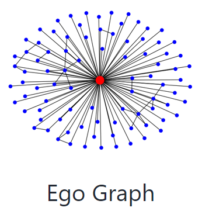

> 人人看得懂的顶会论文系列之：fBox
> ICDM：IEEE International Conference on Data Mining 2014，引用128
> 论文标题：Spotting Suspicious Link Behavior with fBox: An Adversarial Perspective

# 0、背景
二部图（英语：Bipartite **[bai'pɑ:tait]** graph ），又称为二分图、偶图、双分图。直观看就是以下这样的特殊图结构：

```mermaid
graph TB
u1(u1)--> v1 & v2 & v3
u2(u2)--> v2
u3(u3)--> v2 & v3 & v4 & v5

```
u1 & u2 & u3 属于**集合U**，v1 & v2 & v3 & v4 & v5 属于**集合V**，U和V**互斥**。边的集合为**E**，其中所有的边**连接集合U中的一个点和集合V中的一个点**。   
在社交场景，用户给文章虚假点赞、用户虚假关注；广告场景，用户在App上进行异常点击和下载，都可以将用户行为抽象为二部图的异常检测问题进行分析挖掘。

# 一、适用场景
fBox算法是一种针对**二部图**的**无监督**挖掘方法，它不需要任何标签数据来识别可疑的链接行为。  
通过检测Synchronized Attack（一致性行为），识别sockpuppet accounts（马甲账号） 、bot accounts（机器人账号）等异常账号。
[买粉丝网站](https://buy1000followers.co/ '') 价格如下：


孙燕姿在Ins上有381K粉丝，按图中的千个粉丝12.99美金计算，打造一个类似"冷门歌手孙燕姿"粉丝量的虚假大V账号，花费不到**5K美金**。  作为资深风控从业人员+孙燕姿铁杆粉丝，必须识别出假粉，把行业价格打上去。


# 二、算法效果

**具体算法应用效果：**
- 数据集大小：2010年Twitter公布的 **who-follows-whom** 社交关系图，包含**4170万用户**和**15亿边**。
- fBOX能够以0.93以上的精确度正确识别可疑账户，15万个账户被分类为可疑,其中70%Twitter并未处罚（τ≤1）。
- 针对Camouflage resistant 伪装攻击，即使有50%的伪装，FBOX也能捕获超过90%的欺诈粉丝。

- 异常团伙1:只有2条推文但拥有超过1000个关注者的账户；

- 异常团伙2:昵称相似的团伙账号；

- 异常团伙3：一些发布广告推文、宣传链接的账户。

很多异常账号在论文发表的时候依然未被封禁。


# 三、论文创新的点
## 2类对抗攻击
- stealth attacks 隐身攻击
类似黑产攻击时，每次请求都**切换IP和重新生成设备号**。
- Camouflage resistant 伪装攻击
类似社交关注场景，垃圾账号不能只关注买粉的账号，还要关注一些大V之类的正常号，降低自己的可疑度。

## 3类图欺诈检测方法
- **spectral method 谱方法**
eg. SPKEN、Spectral Subspace Plotting
核心思想是利用图的邻接矩阵的**特征值和特征向量**，来识别图中的异常模式或行为。通过SVD分解，寻找在新的坐标系中，一定范围内相似的异常群体。**本文的fBox算法，就属于这类算法的改进。**
- **graph-traversal based methods图遍历方法**  
eg: FaceBook2013年论文提出的COPYCATCH，14年论文提出的SynchroTrap。通过Random Walk等方式取得节点的embedding表示，然后适用聚类等方法发现异常。
其实前面提到的fraudar算法，应该也算作graph based无监督异常检测算法的一种。[从虚假点赞到恶意评论：二部图算法FRAUDAR如何一路斩妖除魔？](https://zhuanlan.zhihu.com/p/687094360 '')
- **feature-based methods**，eg. ODDBALL
基于特征工程的传统分类方法,去识别Ego Graph等图结构。



## 结果比较
||SPOKEN| Spectral Subspace Plotting |COPYCATCH| ODDBALL |FBOX|
|--|--| -- |--| -- |--|
|stealth attacks隐身攻击|×| × |×| × |√|
|Camouflage resistant 伪装攻击|×| √ |√| × |√|
|Offers visualization|√| √ |×| × |√|

## 创新点总结
- 引入了fBox算法，相比谱方法(Spectral Method),该算法能够检测到那些**小规模**、**隐蔽**的攻击，作者对算法的定位更多是对谱方法(Spectral Method)的补充。
- 在大数据集上扩展性好，其计算时间复杂度和输入为线性关系。


# 四、算法的优化目标
传统谱方法(Spectral Method)需要设置一个奇异值的过滤阈值K，K和攻击的规模关系如下图:


可以看到，即使设置K=50或者K=100这样较大的阈值，奇异值依然非常大，比如Twitter Followers里面k=50的奇异值为960.1，即攻击者可以控制960个账号关注其它960个人，而不被检测到。
因此，算法的优化目标为检测：现有算法检测不到的小规模隐蔽攻击。


# 五、算法迭代过程
FBOX的核心思想是，可疑节点和异常节点在SVD分解（Singular value decomposition 奇异值分解）以后的空间中，存在明显区别。

1. **初始化**：
   - 创建两个空集合 `userCulprits` 和 `objectCulprits`，用于存储被标记为攻击者的用户的集合和对象的集合。
   - `outDegrees` 和 `inDegrees`，代表用户的出度和对象的入度。

2. **奇异值分解（SVD）**：
   - 对邻接矩阵 ( A ) 执行奇异值分解，得到 UΣ和V 矩阵，其中 Σ 是对角矩阵，包含奇异值。

3. **计算重建度**：
   - 对于U矩阵中的每个行向量，计算UΣ代表用户在重构空间中的出度。
   - 对于V矩阵中的每个列向量，计算ΣV代表对象在重构空间中的入度。

4. **识别可疑节点**：
```
# 计算SVD分解后空间中，每一个列元素的二阶范数
for each row j in VΣ do
	recInDegs = ‖(VΣ)j‖2

#每个inDegrees的取值分组进行异常判断
for each_unique_id in inDegrees do
	nodeSet = find(inDegrees == id)
	# 根据nodeSet和算法输入的参数τ，计算判断异常的阈值
	recThreshold = percentile(recInDegs(nodeSet), τ )
	for each_node n in nodeSet do
		if recInDegs(n) ≤ recThreshold then
			objectCulprits = objectCulprits + n
		end if
	end for
 end for
```
行元素的异常判断同上。

5. **返回结果**：
算法返回两个集合 `userCulprits` 和 `objectCulprits`，这些集合包含了被识别为攻击者的可疑用户和对象。

算法复杂度：
计算主要集中在**大规模稀疏矩阵**的SVD分解，采用Lanczos 方法来求解。作者给出的测算，时间复杂度和非0输入数据基本线性关系。


# 六、算法在风控场景的应用
FBOX的定位主要是对谱方法进行补充，即补充发现一些谱方法无法找到的**小规模**、**隐蔽**攻击。因此建议作为补充算法使用，去发现高级黑产。


# 后续计划

- [x]  [**FRAUDAR: Bounding Graph Fraud in the Face of Camouflage**]
- 论文情况：2016年论文，361引用
- 论文介绍：采用Dense-block，对二部图，进行无监督异常检测
- 论文解读：[从虚假点赞到恶意评论：FRAUDAR算法如何一路斩妖除魔？](https://zhuanlan.zhihu.com/p/687094360)  

- [x]  **Spotting Suspicious Link Behavior with fBox: An Adversarial Perspective** 
- 论文情况：*2014年*，引用128
- 论文介绍：采用SVD，对二部图，进行无监督异常检测

- [ ] **GANG: Detecting Fraudulent Users in Online Social Networks via Guilt-by-Association on Directed Graphs** 
- 论文情况：*2017*，引用98
- 论文介绍：采用MRF，对二部图，进行无监督异常检测
- 论文解读：2024年4月

- [ ] **二部图无监督异常检测算法 在真实数据集上的效果对比**
- 预计时间：2024年5月，敬请关注期待


## 攻击模式分析
- 朴素注入（Naïve Injection）：欺诈行为集中，an s × c bipartite
core injection会产生最大的领先奇异值σ1 = √(cs)。
- 阶梯注入（Staircase Injection）：f个s × c bipartite core injection 均匀分布。这种攻击模式的领先奇异值σ1 = s√(c/f)。
- 随机图注入（Random Graph Injection）：这种攻击模式将欺诈行为大致均匀地分布在攻击者节点上。这种攻击模式的领先奇异值σ1 ≈ s√(c/f)。